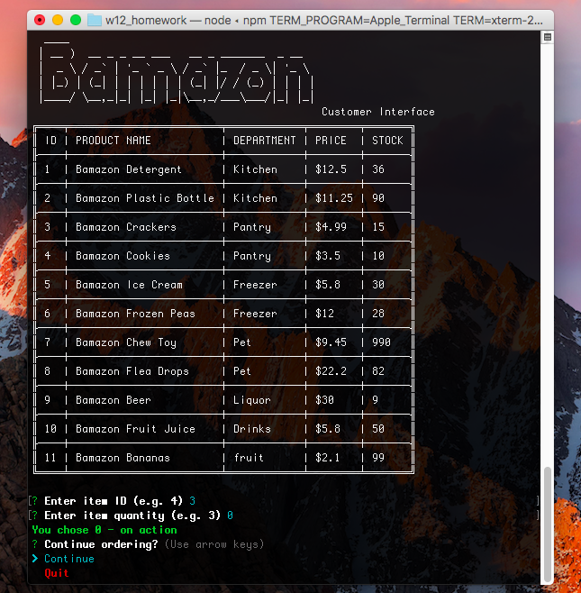
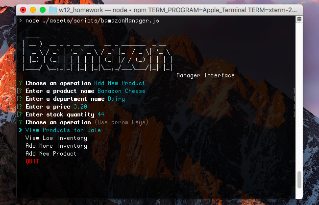

# Bamazon CLI

App features a customer and manager interface for purchasing and managing products, respectively.

## Features

- Terminal based interface
- Manager Interface
  - View products on sale
  - View products with low inventory
  - Add more inventory for a product
  - Create new product
- Customer Interface
  - View items and choose to purchase a specific item and quantity
- Options to continue running application or quit

## Getting Started

Begin by cloning the [bamazon-cli](https://github.com/alex0n0/bamazon-cli) repository:

```terminal
git clone https://github.com/alex0n0/bamazon-cli.git
```

Create a **.env** file and add your database credentials:

```javascript
DB_PASSWORD=your password
```

Populate the database with initializeDB.js that can be run with a node script:

```terminal
npm run initializeDB
```

Choose the node application to run and start the application:

```terminal
EITHER
npm run customer
OR
npm run manager
```

Customer Interface



Manager Interface



## Built With

- Node.js

Database

- MySql

Packages

- MySql
- Inquirer
- Table
- Colors
- Figlet
- Dotenv

## License

This project is MIT licensed. See details [here](https://github.com/alex0n0/bamazon-cli/blob/master/LICENSE).
